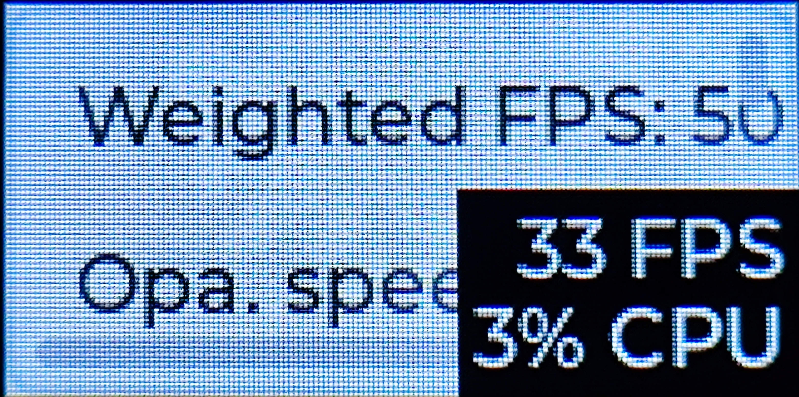

# LVGL project for ESP32

*基于**ESP-IDF v5.1.1**，将**LVGL v7.11.0**移植到合宙ESP32C3-CORE开发板，并适配合宙0.96寸屏幕拓展板。*

## 移植

本项目衍生自LVGL官方移植ESP32的项目，可以使用如下方式进行克隆：

```shell
git clone https://github.com/lvgl/lv_port_esp32.git
```

以下是官方移植的环境要求：

> - Version of ESP-IDF required 4.2. NOTE: We're trying to make this repo backwards compatible, usage of idf.py is encouraged.
> - Version of LVGL used: 7.9.
> - Version of lv_examples used: 7.9.

官方适配到了**ESP-IDF v4.2**、**LVGL v7.9**，但是截至本仓库创建，ESP-IDF最新的稳定版是v5.1.1，所以需要略作修改。

### 配置编译环境

首先启动IDF环境并编译一次：

```shell
. $HOME/esp/esp-idf/export.sh   # 启动环境
idf.py set-target esp32c3       # 设置目标芯片
idf.py menuconfig               # 配置编译选项
idf.py build                    # 编译
```

其中`idf.py menuconfig`中结合《[合宙ESP32C3使用PlatformIO开发点亮ST7735S]》，经测试需要配置如下组件选项`Component config`：

#### lv_examples configuration

| 参数                                            | 值                  | 备注                     |
|-----------------------------------------------|--------------------|------------------------|
| Enable printf-ing data in demos and examples. | 勾选                 | 在演示和示例中启用日志打印          |
| Select the demo you want to run.              | Show demo widgets. | 选择演示:小部件（实际上没效果，后文会解释） |

#### LVGL configuration

| 参数                                                                                        | 值   | 备注                      |
|-------------------------------------------------------------------------------------------|-----|-------------------------|
| Maximal horizontal resolution to support by the library.                                  | 160 | 水平分辨率                   |
| Maximal vertical resolution to support by the library.                                    | 80  | 垂直分辨率                   |
| Swap the 2 bytes of RGB565 color. Useful if the display has a 8 bit interface (e.g. SPI). | 勾选  | 颜色反转，不勾选颜色不对，官方建议SPI屏勾选 |
| Feature usage → Show CPU usage and FPS count in the right bottom corner.                  | 勾选  | 显示帧率和CPU占用，便于调试         |

#### LVGL ESP Drivers

涉及引脚的配置查看合宙手册《[ESP32C3-CORE开发板]》、《[Air10x系列屏幕扩展板]》确定引脚号。

| 参数                                                            | 值              | 备注                                             |
|---------------------------------------------------------------|----------------|------------------------------------------------|
| Display orientation                                           | Landscape      | 横屏模式                                           |
| Select a display controller model.                            | ST7735S        | 选择屏幕驱动芯片                                       |
| Use custom SPI clock frequency.                               | 勾选             | 自定义SPI时钟频率                                     |
| Select a custom frequency.                                    | 40 MHz         | 测试发现合宙这套设备80 MHz花屏，如果画面不稳定可适当调低                |
| Invert colors in display                                      | 勾选             | 反转显示中的颜色，之前还有个颜色反转解决花屏问题，但是会出现黑白相反的反色情况，二者都需开启 |
| Display Pin Assignments → GPIO for MOSI (Master Out Slave In) | 3              | MOSI引脚                                         |
| Display Pin Assignments → GPIO for CLK (SCK / Serial Clock)   | 2              | CLK时钟引脚                                        |
| Display Pin Assignments → GPIO for CS (Slave Select)          | 7              | 片选引脚                                           |
| Display Pin Assignments → GPIO for DC (Data / Command)        | 6              | DC引脚                                           |
| Display Pin Assignments → GPIO for Reset                      | 10             | 重置引脚                                           |
| Backlight Control (Switch control)                            | Switch control | 背光控制设为开关控制（需要更新组件，后面会提到）                       |
| Is backlight turn on with a HIGH (1) logic level?             | 勾选             | 勾选表示高电平开启背光（需要更新组件，后面会提到）                      |
| GPIO for Backlight Control                                    | 11             | 背光引脚（需要更新组件，后面会提到）                             |

### 消除`main.c`报错

编译一次，会出现如下报错：

```shell
error: unknown type name 'esp_timer_create_args_t'
```

查询乐鑫手册能找到这个结构体在头文件`esp_timer.h`，主函数包含此头文件即可消除报错：

```cpp
#include "esp_timer.h"
```

### 更新组件`lvgl_esp32_drivers`

#### `HSPI_HOST`未定义

首先编译会报错`HSPI_HOST`未定义，改成`SPI2_HOST`可以消除，暂且不管，更新组件`lvgl_esp32_drivers`即可解决。

原因大致是SPI外设定义的问题，`SPI2_HOST`是IDF提供的定义。

```shell
error: 'HSPI_HOST' undeclared (first use in this function); did you mean 'SPI2_HOST'?
```

#### `CONFIG_LV_AXP192_PIN_SDA`未定义

其次需要解决使用的组件`lvgl_esp32_drivers`存在的一个bug——“[error: 'CONFIG_LV_AXP192_PIN_SDA' undeclared #285]”。

在`idf.py menuconfig`配置中未开启触控，但报错这个宏未定义，官方已经修复，更新到`lvgl_esp32_drivers`的最新版本可以解决。

更新对应git子模块命令如下：

```shell
# git submodule update --remote <子模块路径>
git submodule update --remote components/lvgl_esp32_drivers
```

#### 处理过时API不兼容问题

由于IDF更新到v5.1.1后，变更了API，同时也更新了FreeRTOS版本，导致如下报错：

```shell
error: implicit declaration of function 'gpio_pad_select_gpio'; did you mean 'esp_rom_gpio_pad_select_gpio'?
error: 'portTICK_RATE_MS' undeclared (first use in this function); did you mean 'portTICK_PERIOD_MS'?
```

按照报错提示修改`components/lvgl_esp32_drivers/lvgl_tft/st7735s.c`即可。

替换该文件内所有`gpio_pad_select_gpio`为`esp_rom_gpio_pad_select_gpio`。其包含在头文件`esp_rom_gpio.h`，参考《[ESP32 GPIO Configuration (gpio_pad_select_gpio)]》。

同样替换文件内所有`portTICK_RATE_MS`为`portTICK_PERIOD_MS`，参考《[FreeRTOS Support Archive]》。

**处理背光控制相关结构体`ledc_timer_config_t`变更导致的报错。**

再次编译，会出现`lvgl_tft/esp_lcd_backlight.c`相关报错：

```text
error: 'ledc_timer_config_t' has no member named 'bit_num'
error: implicit declaration of function 'gpio_matrix_out'; did you mean 'gpio_iomux_out'?
error: implicit declaration of function 'gpio_pad_select_gpio'; did you mean 'esp_rom_gpio_pad_select_gpio'?
error: 'SIG_GPIO_OUT_IDX' undeclared (first use in this function)
```

- 由于API变更导致`ledc_timer_config_t`结构体发生变化，`bit_num`成员已弃用，参考官方《[LEDC外设版本迁移说明]》。将使用的成员变量名`bit_num`改为`duty_resolution`。

| **删除/弃用项目**                        | **替代**                                 | **备注**    |
|------------------------------------|----------------------------------------|-----------|
| `ledc_timer_config_t` 中的 `bit_num` | `ledc_timer_config_t::duty_resolution` | 设置占空比分辨率。 |

- `gpio_matrix_out`所在的头文件由`driver/gpio.h`变为了`rom/gpio.h`，更新之。
- `gpio_pad_select_gpio`的问题在《[处理过时API不兼容问题](#处理过时API不兼容问题 "处理过时API不兼容问题")》小节出现过，替换为`esp_rom_gpio_pad_select_gpio`即可。
- `SIG_GPIO_OUT_IDX`在头文件`soc/gpio_sig_map.h`，包含该头文件。

代码的修改到此结束，不过由于组件`lvgl_esp32_drivers`更新新增了背光配置，还需要使用`idf.py menuconfig`修改`(Top) → Component config → LVGL ESP Drivers → LVGL TFT Display controller`中背光相关设置，按《[LVGL ESP Drivers](#LVGL ESP Drivers "LVGL ESP Drivers")》小节修改即可。

### 烧录

至此编译成功，可以烧录到合宙的 **[ESP32C3-CORE开发板]** ，并配合合宙的 **[Air10x系列屏幕扩展板]** 查看效果。

此时会发现屏幕边缘有花屏情况，且显示的内容倾斜，这是因为显示偏移的问题。如图：


参照《[\[教程\] esp32平台下运行lvgl，使用屏幕st7735s 128*128详细配置]》和《[ESP32开发路程LVGL篇（一）——移植完整过程，花屏问题解决，ST7735显示方向]》所说：

> ST7735s是为128 * 160屏幕设计的，我们是128 * 128的屏幕，需要跳过一部分像素。 作者：繁花cloud https://www.bilibili.com/read/cv14795850/ 出处：bilibili

所以我们需要修改`components/lvgl_esp32_drivers/lvgl_tft/st7735s.h`：

```cpp
// #define COLSTART            26
// #define ROWSTART            1
// 改为：
#define COLSTART            24  // ST7735s是为128 x 160屏幕设计的，我们是160 x 80的屏幕，需要偏移一部分像素。
#define ROWSTART            0   // ST7735s是为128 x 160屏幕设计的，我们是160 x 80的屏幕，需要偏移一部分像素。
```

其中修改的值来自合宙的代码——[Air10x系列屏幕扩展板代码]，其中偏移值分别是`24`、`0`：

```lua
--[[ 此为合宙售卖的0.96寸TFT LCD LCD 分辨率:160X80 屏幕ic:st7735s 购买地址:https://item.taobao.com/item.htm?id=661054472686]]
--lcd.init("st7735v",{port = "device",pin_dc = pin_dc, pin_pwr = bl, pin_rst = pin_reset,direction = 1,w = 160,h = 80,xoffset = 0,yoffset = 24},spi_lcd)
--如果显示颜色相反，请解开下面一行的注释，关闭反色
--lcd.invoff()
--如果显示依旧不正常，可以尝试老版本的板子的驱动
-- lcd.init("st7735s",{port = "device",pin_dc = pin_dc, pin_pwr = bl, pin_rst = pin_reset,direction = 2,w = 160,h = 80,xoffset = 0,yoffset = 0},spi_lcd)
```

再次编译，成功显示！


## 补充

在前面《[配置编译环境](#配置编译环境 "配置编译环境")》一节中在配置`idf.py menuconfig`时，我提到`Select the demo you want to run.`这个设置测试demo的选项无效的情况，这是由于`main.c`中一个宏定义的问题。

```cpp
static void create_demo_application(void)
{
    /* When using a monochrome display we only show "Hello World" centered on the
     * screen */
#if defined CONFIG_LV_TFT_DISPLAY_MONOCHROME || \
    defined CONFIG_LV_TFT_DISPLAY_CONTROLLER_ST7735S
    ……
```

宏定义`CONFIG_LV_TFT_DISPLAY_CONTROLLER_ST7735S`导致只能显示**Hello World**，但是实际上可能是出于分辨率较小的考量才禁用了ST7735S驱动芯片显示其他demo。

可以手动在`main.c`添加头文件：

```cpp
#include "lv_examples/lv_examples.h"
```

然后执行`idf.py menuconfig`设置`Select the demo you want to run.`，选择你想运行的demo.

最后在`create_demo_application`函数中调用你设置的demo对应的函数即可。

这里我选择`Benchmark your system.`测试，结果如下：



## 完结撒花

距离毕业时拿这块开发板做毕设已经过去一年了，感慨良多……

时过境迁，回顾过去，我学了不少，展望未来，我了解得还不够多。闲云潭影日悠悠，物换星移几度秋。孔乙己脱不下长衫，也比不上有着鸿运齐天蛊的理塘王鲜衣怒马少年郎。比之前人，我多了往后时间，却少了过往的机遇风口。前路漫漫，前路渺渺。贾不假，白玉为堂金作马；珍不真，简牍成阶颜如画。

敢问路在何方？但愿路在脚下！

o((>ω< ))o

( •̀ ω •́ )✧

# 引用

- [合宙ESP32C3使用PlatformIO开发点亮ST7735S]
- [ESP32C3-CORE开发板]
- [Air10x系列屏幕扩展板]
- [Air10x系列屏幕扩展板代码]
- [error: 'CONFIG_LV_AXP192_PIN_SDA' undeclared #285]
- [ESP32 GPIO Configuration (gpio_pad_select_gpio)]
- [FreeRTOS Support Archive]
- [\[教程\] esp32平台下运行lvgl，使用屏幕st7735s 128*128详细配置]
- [ESP32开发路程LVGL篇（一）——移植完整过程，花屏问题解决，ST7735显示方向]

[合宙ESP32C3使用PlatformIO开发点亮ST7735S]: https://www.cnblogs.com/jianzhan/p/esp32c3_platformio_st7735s.html "合宙ESP32C3使用PlatformIO开发点亮ST7735S"

[ESP32C3-CORE开发板]: https://wiki.luatos.com/chips/esp32c3/board.html "ESP32C3-CORE开发板"

[Air10x系列屏幕扩展板]: https://wiki.luatos.com/peripherals/lcd_air10x/index.html "Air10x系列屏幕扩展板"

[Air10x系列屏幕扩展板代码]: https://gitee.com/openLuat/LuatOS/blob/master/demo/lcd/main.lua "Air10x系列屏幕扩展板代码"

[error: 'CONFIG_LV_AXP192_PIN_SDA' undeclared #285]: https://github.com/lvgl/lv_port_esp32/issues/285 "error: 'CONFIG_LV_AXP192_PIN_SDA' undeclared #285"

[ESP32 GPIO Configuration (gpio_pad_select_gpio)]: https://www.esp32.com/viewtopic.php?t=25505 "ESP32 GPIO Configuration (gpio_pad_select_gpio)"

[FreeRTOS Support Archive]: https://www.freertos.org/FreeRTOS_Support_Forum_Archive/December_2006/freertos_What_does_portTICK_RATE_MS_stand_for_1636516.html "FreeRTOS Support Archive"

[\[教程\] esp32平台下运行lvgl，使用屏幕st7735s 128*128详细配置]: https://www.bilibili.com/read/cv14795850/ "\[教程\] esp32平台下运行lvgl，使用屏幕st7735s 128*128详细配置"

[ESP32开发路程LVGL篇（一）——移植完整过程，花屏问题解决，ST7735显示方向]: https://blog.csdn.net/weixin_45926435/article/details/131304252 "ESP32开发路程LVGL篇（一）——移植完整过程，花屏问题解决，ST7735显示方向"
